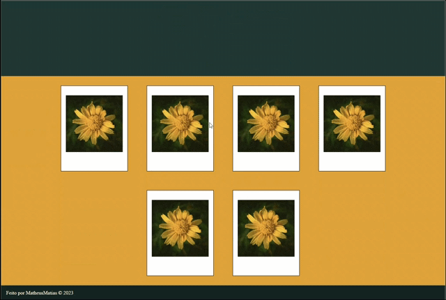

# Polaroid Print

Projeto feito utilizando React.

Teste através do link:

<a>PolaroidPrint</a>

## Adicionar uma imagem na moldura clicando na caixa preta.

## Ajuste os eixos X e Y da imagem para que ela encaixe da melhor maneira.

## Remova a imagem da moldura caso ache necessário.

## Adicione a imagem a lista de polaroids.

## A lista é limitada a 6 imagens.

## Clique em imprimir para abrir a caixa de impressão.

## Configure a impressão!!!

# Suas polaroids terão as seguintes dimensões:

